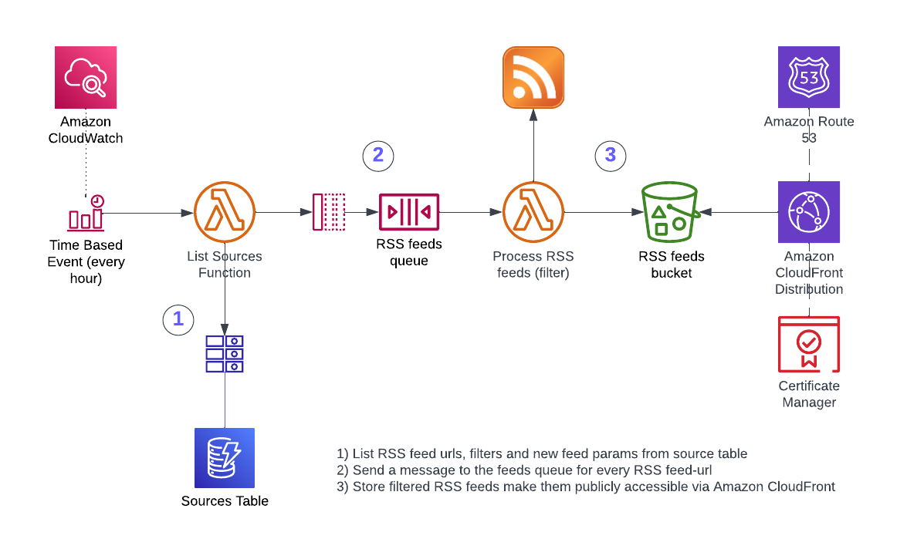
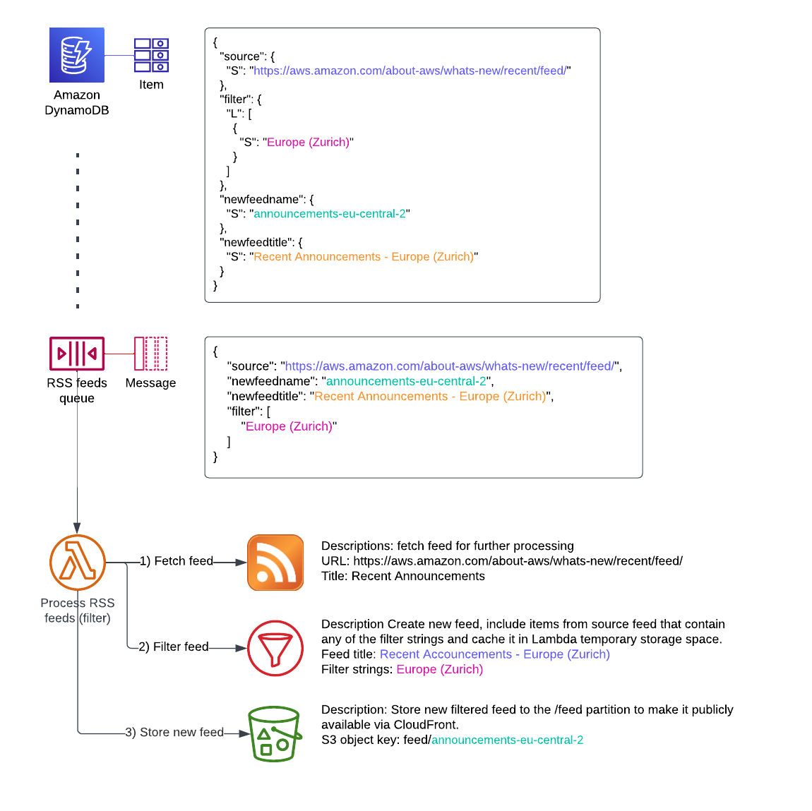

# Filtered RSS feed generator

## Description
RSS is a popular web syndication format that allows users to view updates to a site. This is a configurable serverless solution that generates filtered rss feeds and makes them public accessible. Defined RSS sources are read at a given interval and new filtered feeds are generated and stored.

---

## Architecture overview



The architecture uses a minimum number of AWS services to keep it easy to maintain and cost-effective.
### Resources

  - **Sources Table** - Amazon DynamoDB table that holds all sources of RSS feeds, filter keywords and target feed parameter
  - **RSS feeds Queue** - Amazon SQS queue that dispatches a message for each RSS feed
  - **List Sources Function** - AWS Lambda function that lists all sources of RSS feeds for processing
  - **Process RSS Feeds Function** - AWS Lambda function that checks the RSS feed for new content
  - **RSS feeds bucket** - Amazon S3 bucket that stores new rss feeds and serves feed consumer via Amazon CloudFront distribution

### Sources Table - Schema

| Attribute           | Type              | Description                                                                                    	                |
| ------------------- |:------------------| :---------------------------------------------------------------------------------------------------------------|
| source              | String            | An HTTP/S URL for the RSS feed                                                                 	                |
| filter			        | List of String	  | A list of filter keywords. Regex filter are supported too, e.g.: "Europe \(.{0,}Zurich.[^)]{0,}\)"              |
| newfeedname 		    | String 			      | Key (filename) of the filtered stream object on S3, accessible via CloudFront                                   |
| [newfeedtitle] 		  | String 			      | Optional: Titel of filtered feed (Default: title of source feed)				     			                              |

### Process flow example

In this example the AWS What's New RSS feed is filtered for announcements related to the Europe (Zurich) Region.



---

# Solution deployment
This application should be deployed using the AWS Serverless Application Model Command Line Interface (AWS SAM CLI). Please fine more about the prerequisits and the installation in the [AWS SAM documentation.](https://docs.aws.amazon.com/serverless-application-model/latest/developerguide/serverless-getting-started.html).

In addition Docker is used to simplify Lambda dependency management during the build process. ([Installing Docker to use with the AWS SAM Cli](https://docs.aws.amazon.com/serverless-application-model/latest/developerguide/install-docker.html))
The SAM project deployes the following resources:
- Amazon CloudWatch Event Rule
- Amazon DynamoDB Table
- AWS Lambda Functions
- Amazon SQS Queue
- Amazon S3 Bucket
- AWS Certificate Manager Certificate
- Amazon Route 53 RecordSet

## Parameters
- CloudFrontHostname: The hostname to be used as alias for the CloudFront distribution.
  - Required: Yes
- R53HostedZoneId: R53 HostedZoneId to create the Certificate verification and CloudFront alias record
  - Required: Yes

  ---
  
- [ScheduleExpression]: define how frequently feeds should be updated.
  - Required: No.
  - Default: rate(1 hour).
  - Available rate expressions: https://docs.aws.amazon.com/eventbridge/latest/userguide/eb-create-rule-schedule.html#eb-rate-expressions
- [RSSFeedQueueVisibilityTimeout]: The amount of seconds to wait until a message is made visible again for the RSS feed SQS queue, in case prior processing wasn't successful.
  - Required: No.
  - Default: 90s (min 60s)
- [RSSFeedQueueRetention]: The amount of seconds to retain a message in the channel SQS queue
  - Required: No.
  - Default: 300s

## Build and deployment commands

1. Prepare the serverless application (rss-filtered-feed-gen) for the development
   
    ```bash 
    sam build --use-container
    ```

1. Deploy the serverless application (rss-filtered-feed-gen) to the AWS Cloud

    ```bash
    sam deploy --parameter-overrides ParameterKey="CloudFrontHostname",ParameterValue="<hostname>" ParameterKey="R53HostedZoneId",ParameterValue="<R53 HostedZone Id>"
    ```

1. Once deployed; add the first source feed to the DynamoDB table.
    1. In the AWS console, go to Amazon DynamoDB.
    1. Click **Tables**
    1. Click on the Table name **rss-filtered-feed-gen...**
    1. Click **Actions -> Create Item**
    1. Click **JSON View**
    1. **Paste** and **customize** the following JSON:
        ```bash
        {
          "source": {
            "S": "<SOURCE FEED URL>"
          },
          "filter": {
            "L": [
              {
                "S": "<FILTER STRING>"
              }
            ]
          },
          "newfeedname": {
            "S": "<NEW FEED NAME>"
          },
          "newfeedtitle": {
            "S": "<NEW FEED TITLE>"
          }
        }
        ```
  1. Optional: for test purposes you can manually run the **rss-filtered-feed-gen-ListSourcesFunction...** Lambda function to trigger the flow. Just issue a test run (no input parameters needed) in the Amazon Lambda console or via CLI.
# Resources:
- AWS SAM CLI command reference: https://docs.aws.amazon.com/serverless-application-model/latest/developerguide/serverless-sam-cli-command-reference.html